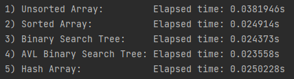

# Data Structures Project 2020-2021

## General Information

This is a team project , was developed by me and [chriszaro](https://github.com/chriszaro). 

- Used Programming language is C++.  
- Header files are located in Headers folder.  
- All .cpp files including main, are located in Sources folder. 

 

## What you can find in this folder ?
In this folder you can find : 
- the [project description (GR)](https://github.com/tsingi-chris/CSD-Auth/blob/main/2nd%20Semester/Data%20Structures/Team%20Project/Project%20Discription.pdf) [💾](https://github.com/tsingi-chris/CSD-Auth/raw/main/2nd%20Semester/Data%20Structures/Team%20Project/Project%20Discription.pdf),
- the code in [headers 📂](https://github.com/tsingi-chris/CSD-Auth/tree/main/2nd%20Semester/Data%20Structures/Team%20Project/Headers) and [source 📂](https://github.com/tsingi-chris/CSD-Auth/tree/main/2nd%20Semester/Data%20Structures/Team%20Project/Sources) folder,
- and a [report (GR)](https://github.com/tsingi-chris/CSD-Auth/blob/main/2nd%20Semester/Data%20Structures/Team%20Project/Data%20Structures%20Assignment%20Report.pdf) that helps with understanding.

 

## Implementation & Output

Implemented Data Structures :
- Unsorted Array
- Sorted Array
- Binary Search Tree
- AVL Tree
- Hash Table
 

This project takes a text file (e.g [small-file.txt](https://github.com/tsingi-chris/CSD-Auth/blob/main/2nd%20Semester/Data%20Structures/Team%20Project/small-file.txt)), and for every differend word that apears, it stores, the word and the times it apears, in the above data structures.  
After that, it saves the data stored in those data structures, in the [output.txt](https://github.com/tsingi-chris/CSD-Auth/blob/main/2nd%20Semester/Data%20Structures/Team%20Project/output.txt) file.  
Finally, the program also outputs :  
  
Which is the time that each stucture takes, to shearch the first 5000 words of the input file (e.g small-file.txt).

 

There may be some changes, in the assignment, from year to year.

